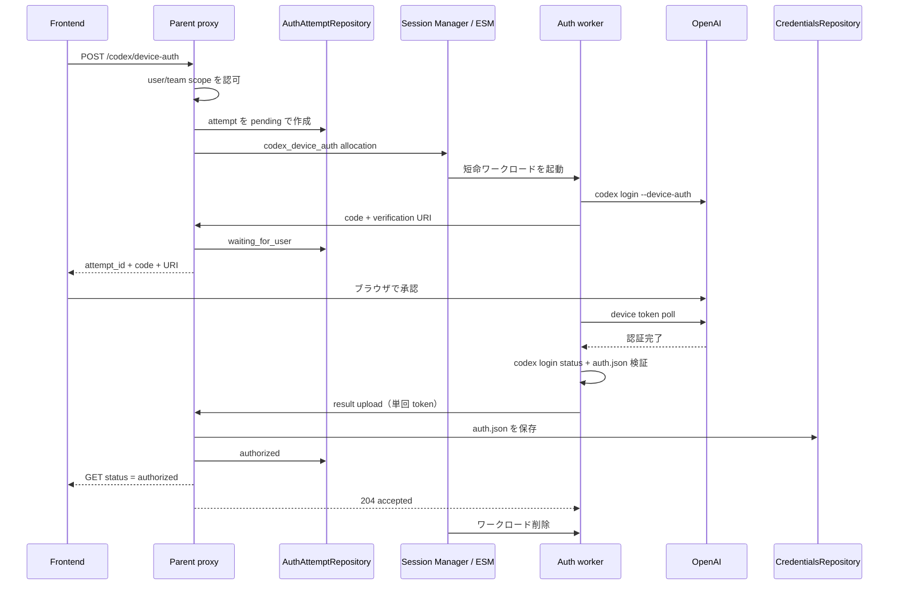

# Codex デバイス認証ワークロード設計

## Status

Proposed。

この文書は、proxy プロセス内で実行している `codex login --device-auth` を、
Session Manager が起動する短命な認証専用ワークロードへ移す設計を定める。

## 背景

現在の `CodexDeviceAuthController` は次の処理を単一の proxy プロセス内で行う。

1. 一時 HOME を作成する
2. `codex login --device-auth` を子プロセスとして起動する
3. 標準出力から verification URI と user code を抽出する
4. プロセス終了後に `~/.codex/auth.json` を読み取る
5. `CredentialsRepository` に user または team scope で保存する

進行中の試行は `sync.Map` に保持されるため、proxy の再起動や別 replica への
ポーリングで失われる。また proxy イメージに Codex CLI を含め、長時間動く外部通信
プロセスと認証情報の平文を proxy のファイルシステムに置く必要がある。

Codex CLI の公式仕様では `codex login --device-auth` がブラウザを起動しない OAuth
device code flow として提供され、`codex login status` による認証確認も提供されている。
本設計は CLI の標準出力と生成ファイルを非公開の内部実装として扱い、Codex CLI の
バージョンを固定して互換性テストを行う。

## 決定

通常の agent session を流用せず、Session Manager に新しい `codex_device_auth`
ワークロード種別を追加する。

- parent proxy は公開 API、認可、試行状態、credential の最終保存を所有する。
- Session Manager / ESM は配置とワークロードの lifecycle を所有する。
- 認証ワークロードは Codex CLI の実行と、結果の一時保持だけを行う。
- `auth.json` の canonical store は既存 `CredentialsRepository` のままとする。
- 認証ワークロードは repository、既存 credential、通常セッション設定を受け取らない。
- user code は秘密情報として扱わないが、ログには出さない。
- `auth.json` は公開 API、allocation result、ログ、環境変数を通過させない。

認証ワークロードは通常セッションと同じ実行基盤・Codex バージョンを利用できるが、
権限と入力を狭めた専用 profile で起動する。

## スコープ

### Goals

- proxy replica の再起動や切り替え後も認証状態をポーリングできる
- local Kubernetes Session Manager と ESM の両方で認証を実行できる
- proxy コンテナから Codex CLI と一時 HOME への依存を除去できる
- user/team scope の既存 credential 保存・認可規則を維持する
- 重複実行、キャンセル、期限切れ、stale callback を明示的に処理する
- 通常セッションへ認証専用 capability を持ち込まない

### Non-goals

- OpenAI OAuth を proxy 自身で再実装すること
- `auth.json` の形式や token refresh を解釈すること
- API key、access token、OpenAI 互換 API の登録方式を変更すること
- 通常の ACP セッションを認証後も維持すること
- credential repository の暗号化方式を変更すること

## コンポーネントと責務

| コンポーネント | 責務 |
| --- | --- |
| Frontend | 開始、code/URI 表示、status poll、キャンセル |
| Parent proxy | 認可、試行作成、配置選択、状態管理、結果回収、credential 保存 |
| AuthAttemptRepository | 認証試行の durable metadata、lease、terminal state の保存 |
| Session Manager / ESM | 認証ワークロードの作成、監視、削除 |
| Auth worker | Codex CLI 実行、出力解析、認証結果の限定的な upload |
| CredentialsRepository | user/team scope の canonical `auth.json` 保存 |

認証ワークロードは Session Pod の runtime data plane に接続しない。対話や任意 HTTP
proxying は不要であり、専用の内部 control API のみを使う。

## フロー



### 開始

1. parent は caller と `scope` / `team_id` を既存規則で認可する。
2. 同じ credential target に非 terminal な試行があれば、新規作成は `409 Conflict` とする。
   `replace=true` は既存試行を cancel してから新しい generation を作る。
3. 128 bit 以上のランダムな `attempt_id` と 256 bit の bootstrap token を生成する。
4. bootstrap token の hash と metadata を durable store に保存する。
5. Session Manager を選び、認証 allocation を登録する。
6. worker が code を報告するまで最大 30 秒待つ。間に合わなければ `202 Accepted` と
   `attempt_id` を返し、frontend は status API から code を取得する。

### 完了

1. Codex CLI が成功終了したら worker は `codex login status` を実行する。
2. worker は `auth.json` が regular file であり、上限サイズ以下の JSON object であることを
   確認する。token の中身やアカウント属性は解釈しない。
3. worker は attempt 単位の bootstrap token で結果を parent に upload する。
4. parent は token hash、attempt ID、manager ID、generation、状態を検証する。
5. parent だけが `CredentialsRepository.Save` を呼び、成功後に状態を `authorized` にする。
6. terminal 状態は短期間保持し、worker と一時 volume は即時削除する。

credential 保存に失敗した場合は `failed` とする。worker からの retry は同じ result digest
なら冪等に受理し、異なる payload は `409 Conflict` として監査ログを残す。

## API

既存 frontend を壊さない移行期間を設ける。新規 client は `attempt_id` を必ず使う。

### Public API

```text
GET    /codex/device-auth/config
POST   /codex/device-auth
GET    /codex/device-auth/{attempt_id}
DELETE /codex/device-auth/{attempt_id}
```

開始 request:

```json
{
  "scope": "user",
  "team_id": "",
  "replace": false,
  "manager_id": ""
}
```

開始 response は code を既に取得できた場合 `200 OK`、allocation 中なら
`202 Accepted` とする。

```json
{
  "attempt_id": "cda_...",
  "status": "waiting_for_user",
  "user_code": "ABCD-EFGH",
  "verification_uri": "https://...",
  "expires_at": "2026-09-06T12:10:00Z",
  "poll_after_ms": 2000
}
```

status は以下に限定する。

```text
pending_allocation
starting
waiting_for_user
authorized
denied
expired
cancelled
failed
```

`failed` response は安定した `error_code` と再試行可否のみ返す。CLI の生出力や token、
内部 Pod 名は返さない。

旧 `POST /codex/device-auth/token` は移行期間中、caller の最新 active attempt を解決して
新 status API と同じ状態を旧形式に丸める。active attempt がない場合に `pending` を返す
現在の曖昧な挙動は、新 API では `404 Not Found` にする。

`GET /codex/device-auth/config` の `configured` は proxy 内の `codex` executable 有無ではなく、
認証 workload を実行可能な Session Manager が一つ以上あるかを表す。追加情報を返す。

```json
{
  "configured": true,
  "execution_mode": "auth_workload",
  "available_managers": 2
}
```

### Internal worker API

```text
POST /internal/codex-device-auth/{attempt_id}/challenge
POST /internal/codex-device-auth/{attempt_id}/result
POST /internal/codex-device-auth/{attempt_id}/heartbeat
```

- `challenge` は code、verification URI、CLI version を一度登録する。
- `result` は `authorized` と `auth_json`、または terminal error を登録する。
- `heartbeat` は worker lease を更新する。認証状態や CLI 出力は含めない。
- すべて attempt-scoped Bearer token、manager ID、generation で fence する。
- request body は既定 64 KiB、`auth_json` は既定 32 KiB を上限とする。

bootstrap token は Secret volume の mode `0400` ファイルで渡す。環境変数、Pod spec の
annotation、allocation の診断表示には出さない。

## データモデル

```text
CodexDeviceAuthAttempt
  id                  cda_ + random ID
  owner_scope         user | team
  owner_id            canonical user ID または team ID
  requested_by        caller user ID
  credential_name     保存先の既存 canonical key
  manager_id
  generation
  status
  verification_uri    nullable
  user_code           nullable
  cli_version         nullable
  result_digest       nullable
  error_code          nullable
  retryable           nullable
  token_hash
  created_at
  updated_at
  expires_at
  terminal_at         nullable
```

`verification_uri` は `https` のみ許可し、Codex CLI が出力した host の allowlist を設定可能に
する。user code と URI は terminal 後に消去し、試行 metadata は監査・UX のため既定 24 時間
保持する。token hash と result digest は同じ retention に従う。

`credential_name` は開始時に確定し、worker が指定できないようにする。team membership は
開始時と保存直前の両方で確認する。保存前に権限を失った場合は `failed/access_revoked` とし、
個人 credential へ fallback しない。

## Allocation と配置

通常セッション用 `AllocationRequest` に optional field を足すのではなく、共通 envelope と
用途別 payload を導入する。

```text
WorkloadAllocation
  id
  kind                agent_session | codex_device_auth
  manager_id
  generation
  expires_at
  payload             kind ごとの tagged union
```

`codex_device_auth` payload に含めるもの:

- attempt ID
- parent callback URL
- bootstrap credential Secret の material
- Codex CLI image/version
- resource limits と deadline

含めないもの:

- user/team の既存 credentials
- repository URL、GitHub token、managed files
- MCP、plugins、skills、session profile
- parent API key、ESM registration token、Redis credential

Session Manager は `codex_device_auth_v1` capability を heartbeat で広告する。明示
`manager_id` がなければ capability、health、scope/team policy、region label で選択する。
対応 manager がなければ開始前に `503 auth_workload_unavailable` を返し、proxy 内実行へ
暗黙に fallback しない。

### Kubernetes workload

MVP は `Job` ではなく controller が明示削除する単一 Pod とする。device flow は外部承認を
待つため Kubernetes Job の retry が同じ attempt を重複実行しやすいためである。

- `restartPolicy: Never`
- `activeDeadlineSeconds: 600`（設定可能）
- read-only root filesystem
- non-root、privilege escalation 無効、全 Linux capability drop
- `emptyDir` を専用 HOME として mount
- ServiceAccount token の automount 無効
- repository/PVC/hostPath は mount しない
- egress は OpenAI 認証 endpoint、DNS、parent callback のみに限定
- CPU 100m request / 500m limit、memory 128 MiB request / 512 MiB limit を初期値とする
- termination grace period 5 秒

Pod 名、label、イベントに user ID、team ID、user code を含めない。attempt ID はランダムで
個人情報を含まないため label に利用できる。

### Worker contract

worker は shell script ではなく小さな subcommand とする。

```text
agentapi-proxy codex-auth-worker \
  --attempt-id-file /run/agentapi/attempt-id \
  --token-file /run/agentapi/token \
  --parent-url-file /run/agentapi/parent-url
```

標準出力は構造化された機密除去済みイベントだけにし、Codex CLI の stdout/stderr は worker
内部で解析する。未知の出力形式、複数 URI/code、上限超過行は fail closed とする。

Codex CLI と auth worker を同じ image に含め、image digest と CLI version を allocation
metadata に記録する。通常 agent session image と version をそろえるが、release は digest で
独立して rollback 可能にする。

## 状態遷移と競合制御

```text
pending_allocation -> starting -> waiting_for_user -> authorized
                                      |             -> denied
                                      |             -> expired
                                      +------------ -> failed
任意の非 terminal 状態 ----------------------------> cancelled
```

- 更新は `attempt_id + generation + current_status` の compare-and-swap とする。
- terminal 状態からの遷移は禁止する。
- worker lease が 75 秒更新されなければ manager が reconcile する。
- deadline 到達時は parent が `expired` にし、token を revoke して削除 operation を送る。
- 古い generation の challenge/result は `409 Conflict` とし credential を更新しない。
- 同じ target の active attempt は一つだけ許可する durable unique constraint を設ける。

## キャンセルと cleanup

`DELETE` は先に attempt を `cancelled` にして bootstrap token を revoke し、その後 workload
削除を best effort で依頼する。これにより削除が遅れても credential は保存されない。

Session Manager は次を reconcile する。

- terminal attempt の Pod を即時削除
- deadline を過ぎた Pod を削除
- attempt record が存在しない孤児 Pod を削除
- generation が一致しない Pod を削除

worker 終了時の一時 HOME 削除だけに依存せず、Pod/`emptyDir` の破棄を秘密情報消去の境界と
する。node disk の暗号化は deployment requirement とする。

## セキュリティ

### Trust boundary

認証ワークロードは最終的な `auth.json` を生成するため credential writer と同等に機密性が
高い。ただし既存 credential の read 権限、任意 credential 名への write 権限、Kubernetes
API 権限は与えない。

parent は worker から受け取った JSON を credential として保存する前に以下を確認する。

- authenticated attempt と target が一致する
- attempt が未完了で期限内である
- manager ID と generation が active allocation と一致する
- body size、JSON syntax、top-level object
- 同一 attempt の result digest が不変である
- 保存直前にも caller/owner の認可が成立する

`auth.json`、callback token、Codex CLI の生出力は application log、audit detail、metrics label、
trace attribute に記録しない。監査ログには attempt ID、requester、scope、target hash、結果、
manager、CLI version、時刻だけを残す。

### Team credential

既存仕様との互換性のため team member による team credential 更新を当面維持する。ただし
共有 credential の影響が大きいため、別途 `credentials:write_team` 権限へ分離可能な設計に
する。開始者と保存時の実行者を audit event に残す。

## 可用性とエラー

| 障害 | 動作 |
| --- | --- |
| proxy replica restart | durable attempt を別 replica が返す。worker callback は継続する |
| ESM unavailable before allocation | `503`、attempt は作らないか直ちに retryable failed |
| ESM unavailable after start | worker は parent へ直接 callback できれば継続する |
| worker crash | lease 切れ後に failed。自動再実行せずユーザーが再試行する |
| CLI output format changed | `failed/cli_protocol_error`。生出力は機密除去して診断可能にする |
| credential store unavailable | result digest を保持して bounded retry。期限後 failed |
| parent unavailable | worker は指数 backoff。auth.json は emptyDir 内だけに保持する |
| team access revoked | 保存せず `failed/access_revoked` |
| duplicate result | 同 digest は成功を再応答、異なる digest は拒否 |

parent callback が長時間停止する場合に備え、認証完了後の result upload retry window を
5 分とする。期限切れ後は worker が file を削除して終了する。

## Observability

低 cardinality metrics:

- `codex_device_auth_attempts_total{status,scope}`
- `codex_device_auth_duration_seconds{outcome}`
- `codex_device_auth_allocation_duration_seconds{manager_type}`
- `codex_device_auth_active_attempts`
- `codex_device_auth_cleanup_total{reason}`

attempt ID は log correlation にのみ使い、metrics label にしない。アラート対象は allocation
失敗率、CLI protocol error、cleanup failure、active attempt の異常増加とする。

## 設定

```yaml
codex_device_auth:
  execution_mode: workload # workload | in_process（移行用）
  deadline: 10m
  worker_lease: 75s
  result_retry_window: 5m
  terminal_retention: 24h
  max_auth_json_bytes: 32768
  max_output_line_bytes: 16384
  image: "" # 未指定なら session image と同じ digest
  allowed_verification_hosts: []
```

`execution_mode` は rollout 中だけ必要で、安定後は `workload` 固定にして proxy image から
Codex CLI と in-process 実装を削除する。mode は attempt 作成時に記録し、進行中に変更しない。

## 実装順

1. `CodexDeviceAuthAttempt` と repository、attempt ID を使う public API を追加する。
2. 現在の in-process runner を新 repository に接続し、frontend を新 API に移行する。
3. auth worker subcommand と内部 callback API、fencing、冪等 result upload を追加する。
4. local Kubernetes Session Manager に `codex_device_auth_v1` allocation と Pod lifecycle を追加する。
5. ESM registration/capability と external allocation を追加する。
6. `execution_mode=workload` を既定にし、旧 token poll API を deprecate する。
7. 観測期間後に proxy 内の Codex CLI、`sync.Map`、一時 HOME 実装を削除する。

通常セッション allocation の tagged union 化が大きすぎる場合、MVP では独立した
`AuthWorkloadQueue` を実装してよい。ただし manager capability、generation fencing、lease、
callback credential は通常 session allocation と共通 primitive を再利用する。

## テスト計画

### Unit / contract

- user/team scope の認可と保存直前の再認可
- 同一 target の unique active attempt と `replace`
- 全状態遷移、CAS 競合、期限切れ、キャンセル
- callback token、manager、generation の不一致
- result upload の同一/異なる digest に対する冪等性
- oversized/invalid JSON、symlink、missing `auth.json`
- CLI stdout の ANSI、分割行、順序違い、未知形式、上限超過
- API の旧形式互換

### Integration

- fake device server を使った worker success/denied/timeout
- parent replica を code 発行後と result upload 前に再起動
- callback の一時的な 5xx と retry
- credential repository failure と回復
- cancel/result race で credential が保存されないこと
- team membership revoke/result race

### Kubernetes / ESM E2E

- local manager と ESM で code 表示から credential 保存まで完了
- Pod に repository、既存 credentials、ServiceAccount token が存在しないこと
- Pod 強制削除、deadline、孤児 cleanup
- stale generation の worker が credential を更新できないこと
- network policy が不要な宛先を拒否すること
- 完了後に Pod、Secret、emptyDir の参照が残らないこと

受け入れ条件は、認証完了後に新しい Codex session が保存済み credential で起動できること、
および proxy/worker/ESM のログと allocation metadata に credential 内容が現れないこととする。

## Rollout と rollback

1. attempt repository と新 API を deploy し、`in_process` で動かす。
2. 対応 Session Manager が capability を広告した環境だけ user 単位で workload mode を有効化する。
3. local Kubernetes、ESM の順に段階展開する。
4. error rate、完了時間、cleanup を比較して既定を workload にする。
5. 旧 API の利用がなくなってから in-process 実装を削除する。

rollback は新規 attempt だけ `in_process` に戻す。進行中 attempt の execution mode は変更せず、
完了または期限切れまで元の runner で処理する。保存済み credential の形式と repository は
変更しないため、通常 session 起動側の rollback は不要である。

## 検討した代替案

### 通常の agent session をそのまま起動する

採用しない。repository clone、runtime server、managed files、MCP、session route など認証に
不要な attack surface とコストが増え、session 一覧・quota・課金の意味も曖昧になる。

### proxy 内実行を維持する

構成は単純だが、replica-local state、CLI 同梱、認証 subprocess と credential file が proxy
の trust boundary 内に残るため、長期形として採用しない。移行用 fallback のみにする。

### worker が CredentialsRepository へ直接保存する

採用しない。worker に広い database/Kubernetes Secret 権限が必要になり、target の差し替えや
別 credential の読み書きを防ぐ境界が弱くなる。attempt-scoped callback に限定する。

### auth.json を PVC 経由で回収する

採用しない。cleanup とアクセス制御が複雑になり、短時間の認証結果に durable volume は不要で
ある。bounded HTTPS upload と `emptyDir` の方が秘密情報の lifetime を短くできる。

## Open questions

- team credential 更新を member のまま維持するか、admin/専用 permission に限定するか
- auth workload を通常 session quota と別 quota にする場合の既定値
- ESM が parent callback へ直接到達できない環境をサポートするか
- verification host を固定 allowlist にするか、Codex CLI version ごとの manifest にするか
- terminal metadata の retention を audit policy とどう統合するか

## References

- [OpenAI Codex developer commands](https://learn.chatgpt.com/docs/developer-commands?surface=cli)
- [Direct Session Runtime Control](./direct-session-runtime.md)
- [ACP セッション永続化設計](./acp-session-persistence.md)
