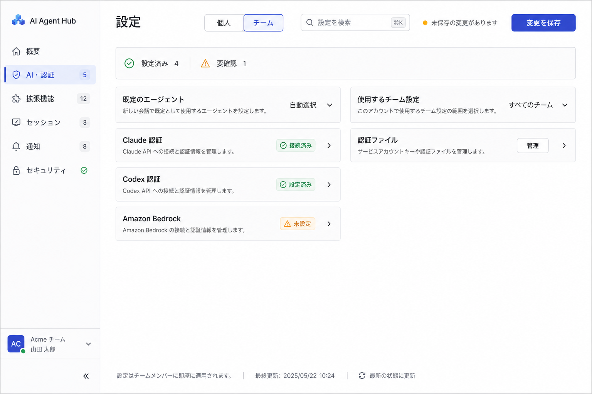

# Settings information architecture proposal

## Objective

Make settings easier to scan by separating the setting owner from the setting purpose, reducing repeated card chrome, and keeping save state and search visible.

## Proposed structure

The `Personal` / `Team` choice becomes a scope switch in the page header. The primary navigation is reorganized by user intent:

| Category | Current settings included |
| --- | --- |
| Overview | Setup status, warnings, recently changed settings |
| AI & authentication | Default agent, preferred team, Claude OAuth, Codex credentials, Bedrock |
| Extensions | Marketplace, plugins, MCP servers |
| Sessions | Environment variables, key bindings, font, external session managers, session files |
| Notifications | Slack user and notification channels |
| Security | API tokens, credentials, logout and destructive account actions |

## Density rules

- Use 40–48 px setting rows with a label, one-line description, current value or status, and a trailing action.
- Use a two-column grid at desktop widths; collapse to one column below the existing medium breakpoint.
- Reserve expanded panels for forms and multi-item editors. Do not wrap every setting group in an accordion.
- Keep scope, search, unsaved state, and the save action in a sticky page header.
- Show setup state with concise chips such as `Connected`, `Configured`, and `Not configured`.
- Put counts on navigation items so users can judge section size before opening it.
- Move long explanations into inline help or disclosure panels; keep the default view scannable.

## Suggested first implementation slice

Start with Personal settings and move Default Agent, preferred team, Claude OAuth, Codex credentials, and Bedrock into the new AI & authentication section. This validates the shell, compact row component, responsive grid, and sticky save behavior before migrating the more complex list editors.

## Image generation record

- Mode: built-in image generation
- Use case: `ui-mockup`
- Direction: high-fidelity desktop SaaS settings screen with purpose-based navigation, personal/team scope switch, search, sticky save state, compact two-column rows, and restrained status colors
