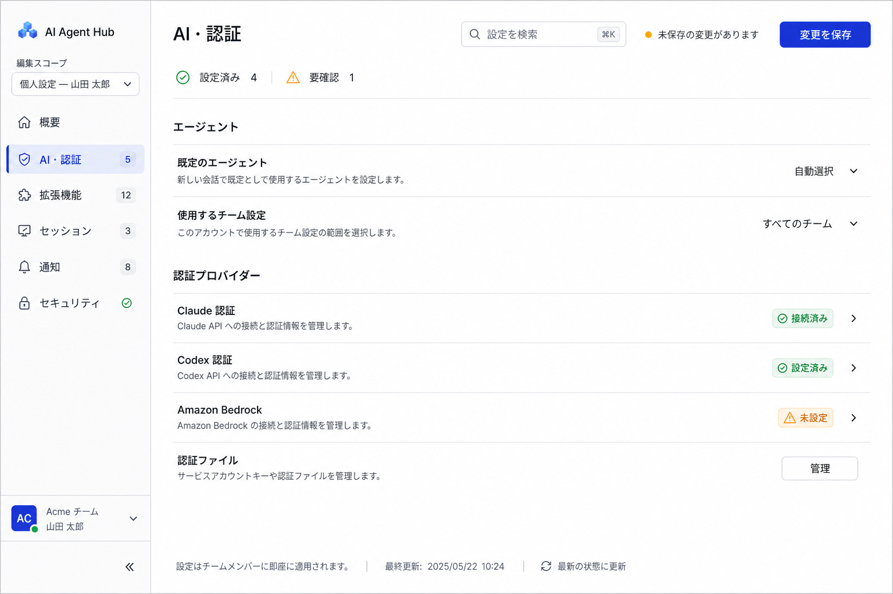

# Settings information architecture proposal

## Objective

Make settings easier to scan by separating the setting owner from the setting purpose, removing repeated card and accordion chrome, and keeping save state and search visible.

## Proposed structure

The setting owner becomes an **Edit scope** dropdown at the top of the sidebar. It shows the exact target, such as `Personal settings — Jane Doe` or `Team settings — Platform`, while the primary navigation below it is organized by user intent:

| Category | Current settings included |
| --- | --- |
| Overview | Setup status, warnings, recently changed settings |
| AI & authentication | Default agent, preferred team, Claude OAuth, Codex credentials, Bedrock |
| Extensions | Marketplace, plugins, MCP servers |
| Sessions | Environment variables, key bindings, font, external session managers, session files |
| Notifications | Slack user and notification channels |
| Security | API tokens, credentials, logout and destructive account actions |

## Density rules

- Use conventional full-width setting rows with a label and one-line description on the left, plus the current value, status, or action on the right.
- Separate rows with thin horizontal rules on one flat content surface. Do not place individual settings in cards.
- Show all settings in the selected category. Do not use accordions or collapsed panels.
- Keep the edit scope visible at the top of the sidebar; keep search, unsaved state, and the save action in a sticky page header.
- Show setup state with concise chips such as `Connected`, `Configured`, and `Not configured`.
- Put counts on navigation items so users can judge section size before opening it.
- Move long explanations into inline help or dedicated detail screens; keep the category view scannable.

## Suggested first implementation slice

Start with Personal settings and move Default Agent, preferred team, Claude OAuth, Codex credentials, and Bedrock into the new AI & authentication section. This validates the sidebar scope selector, flat setting-row component, and sticky save behavior before migrating the more complex list editors.

## Image generation record

- Mode: built-in image generation
- Use case: `ui-mockup`
- Direction: high-fidelity desktop SaaS settings screen with purpose-based navigation, sidebar edit-scope dropdown, search, sticky save state, flat full-width rows, no cards or accordions, and restrained status colors
